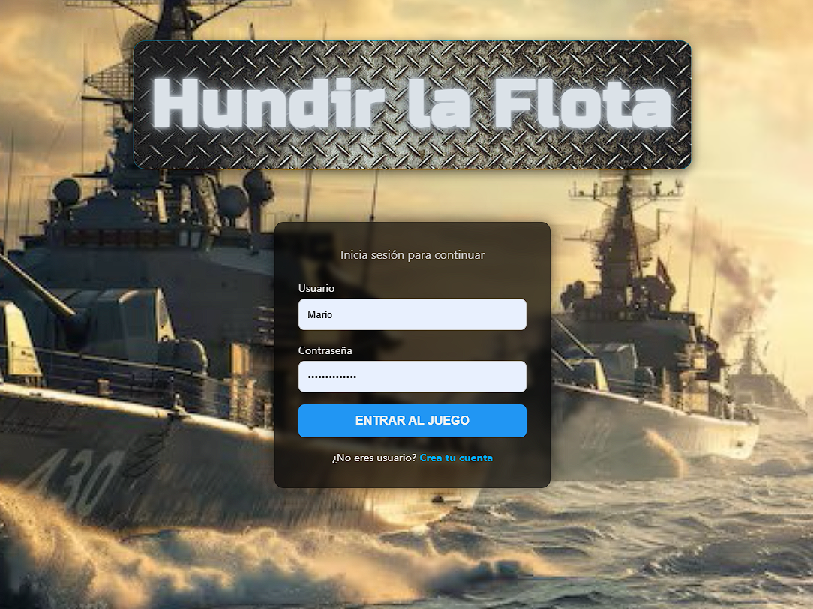
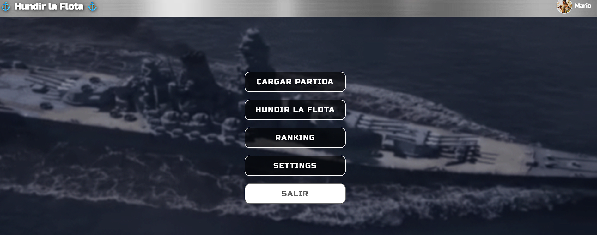
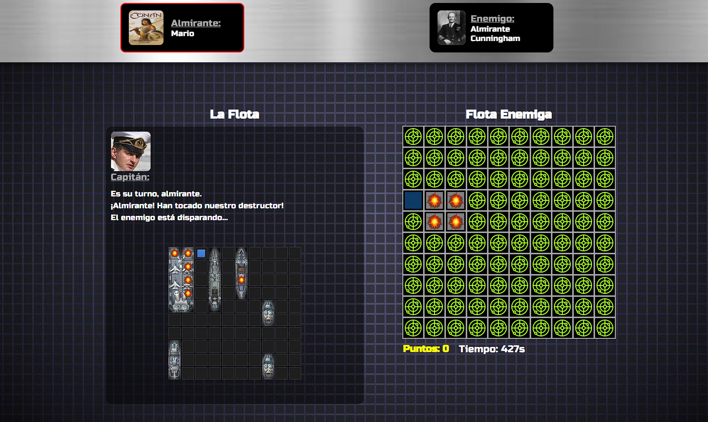

# Hundir la Flota 🎯⚓

<div align="center">
  
</div>

**Hundir la Flota** es un juego web completamente funcional basado en el clásico Battleship.
El jugador coloca su flota, elige un almirante enemigo y se enfrenta a una **IA avanzada** que analiza impactos, sigue patrones inteligentes y remata barcos con precisión estratégica.

El proyecto cuenta con perfiles, estadísticas, partidas guardadas, sonido, animaciones y un sistema de IA capaz de resolver barcos complejos como portaaviones **2×5**.

---

## 🛠 Tecnologías utilizadas

- **HTML5** – Estructura de la interfaz
- **CSS3** – Estilos, animaciones y diseño visual
- **JavaScript (ES6)** – Lógica del juego, eventos y IA
- **PHP** – Backend, sesiones, controladores
- **MySQL / MariaDB** – Base de datos
- **Fetch API (AJAX)** – Comunicaciones asíncronas
- **Google Fonts** – Tipografía temática militar

---

## 📂 Estructura del proyecto

```
Hundir-la-flota/
├─ assets/
│  ├─ css/             # Estilos del juego
│  ├─ js/              # Lógica, eventos, IA enemiga
│  ├─ img/             # Iconos, barcos, fondos, avatares
│  ├─ music/           # Música temática
│  ├─ sounds/          # Efectos de sonido
│  └─ pribate/
│       └─ bbdd.sql    # Script SQL para crear la base de datos
│
├─ php/                # Backend, sesiones, controladores, conexión MySQL
├─ juego/              # Pantallas del tablero y desarrollo de partida
│
├─ index.php           # Login / Registro
└─ README.md
```

---

## 🎮 Características principales

- ✔️ Juego completamente funcional
- ✔️ Tablero con animaciones, sonidos e interfaz intuitiva
- ✔️ IA avanzada: **hunt → target → orientación → remate**
- ✔️ Compatible con barcos especiales (portaaviones 2×5, etc.)
- ✔️ Evita casillas prohibidas alrededor de barcos hundidos
- ✔️ Guardado y carga de partidas
- ✔️ Sistema de usuario con foto, estadísticas y fecha de registro
- ✔️ Historial de victorias contra cada almirante
- ✔️ Música persistente entre pantallas

---

<div align="center">
  
</div>

## 🚀 Estado actual

Completado:

- ✔️ Núcleo jugable
- ✔️ IA enemiga avanzada
- ✔️ Sistema de turnos
- ✔️ Guardado/carga de partidas
- ✔️ Estadísticas y perfiles

En desarrollo:

- Ranking global
- Dificultades por almirante
- Mejoras visuales
- Responsive avanzado
- Nuevos efectos de sonido

---

<div align="center">
  
</div>

# 🔧 Configuración de credenciales (archivo `.env`)

El archivo `php/conexion.php` NO debe editarse.
Cada usuario debe crear su propio archivo con credenciales privadas.

### 1️⃣ Crear el archivo `.env` en la raíz del proyecto:

```
DB_HOST=localhost
DB_USER=root
DB_PASS=tu_contraseña
DB_NAME=hundir_flota
```

### 2️⃣ Añadir al `.gitignore`:

```
.env
```

### 3️⃣ El sistema ya está preparado para leerlo automáticamente

No es necesario modificar código ni rutas.

---

# 🔧 Instalación en Linux

### 📌 Requisitos

- PHP
- MySQL o MariaDB
- Extensión `mysqli` habilitada

### 📥 Instalación paso a paso

1. Clonar el repositorio:

   ```bash
   git clone https://github.com/tu-repo/Hundir-la-flota.git
   ```

2. Entrar al proyecto:

   ```bash
   cd Hundir-la-flota
   ```

3. Instalar MySQL si no lo tienes:

   ```bash
   sudo apt install mysql-server
   ```

4. Crear la base de datos ejecutando el script:

   ```bash
   mysql -u tu_usuario -p < assets/pribate/bbdd.sql
   ```

5. Crear tu archivo `.env` con tus credenciales reales.

6. Levantar el servidor PHP:

   ```bash
   php -S localhost:8000
   ```

7. Abrir en el navegador:

   ```
   http://localhost:8000
   ```

---

# 🔧 Instalación en Windows

## Método 1 — PHP nativo (sin XAMPP)

1. Instalar PHP:
   [https://windows.php.net/download](https://windows.php.net/download)

2. Instalar MySQL:
   [https://dev.mysql.com/downloads/installer/](https://dev.mysql.com/downloads/installer/)

3. Ejecutar el script SQL:

   ```cmd
   mysql -u root -p < assets\pribate\bbdd.sql
   ```

4. Crear el archivo `.env`.

5. Ejecutar servidor:

   ```cmd
   php -S localhost:8000
   ```

6. Navegar a:

   ```
   http://localhost:8000
   ```

Perfecto, lo ajusto.
Aquí tienes **solo la parte corregida**, tal como me pediste:

---

## Método 2 — Usando XAMPP (recomendado)

1. Descargar XAMPP:
   [https://www.apachefriends.org/es/index.html](https://www.apachefriends.org/es/index.html)

2. Instalarlo.

3. **Clonar o descargar el repositorio directamente dentro del directorio `htdocs`:**

   ```
   C:\xampp\htdocs\Hundir-la-flota\
   ```

   Ejemplo usando Git Bash o PowerShell:

   ```cmd
   cd C:\xampp\htdocs
   git clone https://github.com/tu-repo/Hundir-la-flota.git
   ```

4. Abrir el panel de XAMPP y arrancar **Apache** y **MySQL**.

5. Crear la base de datos ejecutando el SQL:

   **Opción A — Por CMD**

   ```cmd
   cd C:\xampp\mysql\bin
   mysql -u root < C:\xampp\htdocs\Hundir-la-flota\assets\pribate\bbdd.sql
   ```

   **Opción B — Por phpMyAdmin**

   - Abrir `http://localhost/phpmyadmin/`
   - Crear nueva base de datos
   - Ir a **Importar → seleccionar `bbdd.sql`**

6. Crear tu archivo `.env` en la raíz del proyecto:

   ```
   DB_HOST=localhost
   DB_USER=root
   DB_PASS=
   DB_NAME=hundir_flota
   ```

7. Acceder al juego:

   ```
   http://localhost/Hundir-la-flota/
   ```

---

# ⚠ Notas importantes

### ✔ Linux

- Las rutas distinguen mayúsculas/minúsculas.
- Usa siempre `/` en rutas.

### ✔ Windows

- En XAMPP se puede usar MySQL local sin problemas.
- El proyecto **debe estar dentro de `htdocs`** para funcionar con Apache.

### ✔ En ambos sistemas

- **NO modifiques `php/conexion.php`.**
- **Crea tu `.env` con tus datos reales.**
- **Instala MySQL** y usa el script SQL incluido en el proyecto.

---

## 📜 Licencia

Proyecto para uso personal y educativo.
Se permite su uso libre con fines formativos.

---
